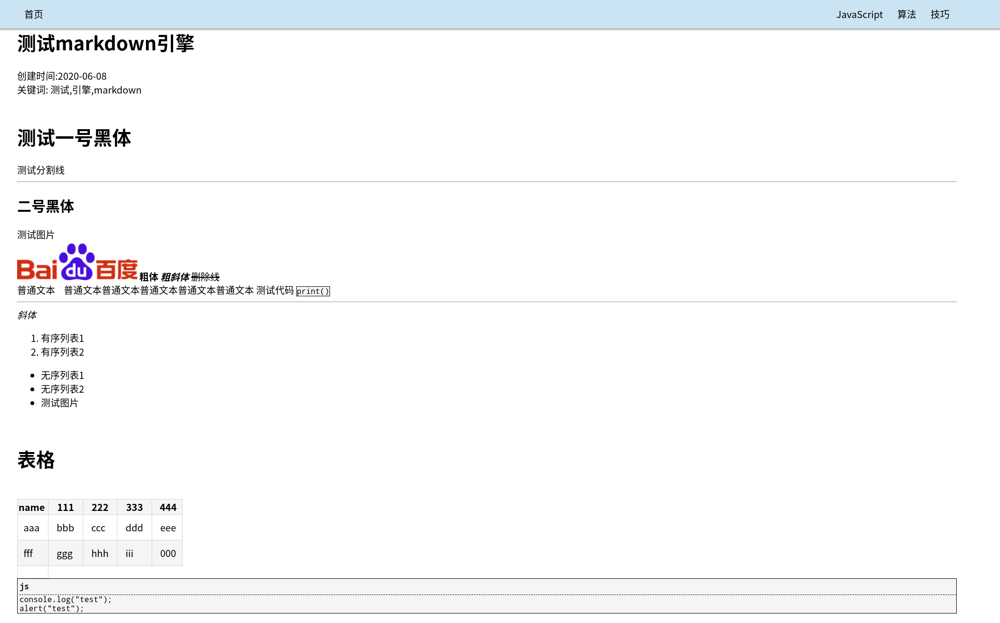

# static-blog-system-vue

### 一键拥有自己的博客，支持热更新博文，包含markdown引擎。只需要一次性解压到任何静态服务器，例如免费的GithubPages。项目采用Vue。
---
✔ markdown 转HTML DOM解释器

✔ 博文显示组件

✔ 博文分类界面

✔ 博文简介界面

⬚ css美化

⬚ 主界面布局美化

⬚ 博文搜索

⬚ 关于界面

---
# 引擎测试


# 主界面(暂时无样式仅测试)
.png)

# 博文界面(暂时无样式仅测试)
.png)

### 启动前安装依赖 Project setup
```
yarn install
```

### 启动测试 Compiles and hot-reloads for development
```
yarn serve
```

### 编译 Compiles and minifies for production
```
yarn build
```

### vue-cli 帮助文档 Customize configuration
See [Configuration Reference](https://cli.vuejs.org/config/).
